# FANGO User Guide

## 1. Introduction 

### What is FANGO?
`FANGO` is a just-in-time language companion designed for travellers, learners, and curious explorers. Instead of studying lessons, you learn from the world around you—by snapping a photo of real-world objects. 

`FANGO` instantly identifies the object, translates it into your chosen language, pronounces it aloud, and gives you practical phrases you can use immediately.

### Who is this guide for?
Anyone using the `FANGO` mobile or web app to translate objects, learn vocabulary on the go, or personalize their language-learning experience.

## 2. Getting Started
### Creating an Account
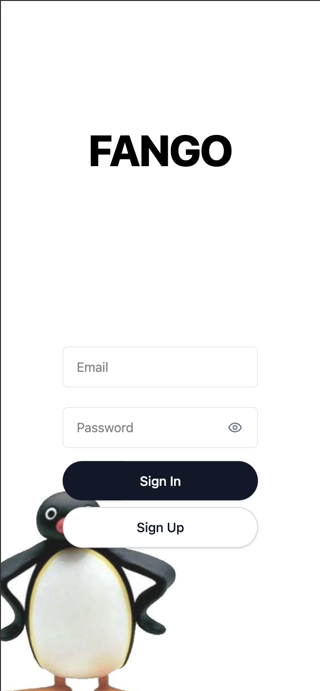
- The very first page 
- User needs to tap / click "Sign Up" for creating a new account

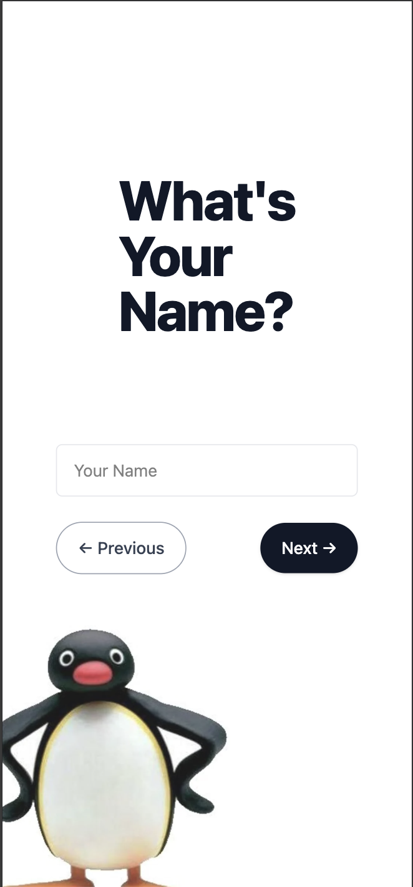

- user needs to fill up blanks for name, password ...
- hit next button whenever they're done

- if user sees 'You're All Set!' page, they're done
- it will navigate a user to a quick tour (user guide) automatically 

### Quick Guide
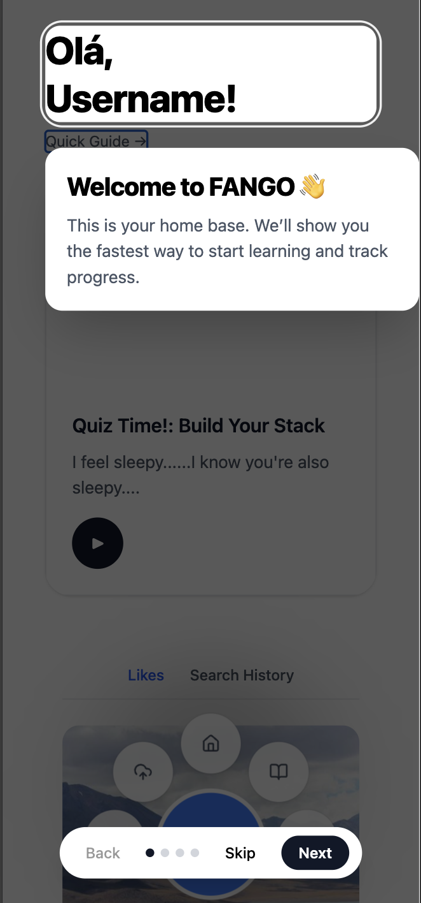
- Quick Guide will show users how to navigate the app
- User can skip with Skip button
- use Back or Next buttons for Quick Guide
- They can pull up user guide anytime on the landing page

### Logging in
- hit sign in button with proper email and password

- forgot password?

- if login success, landing page
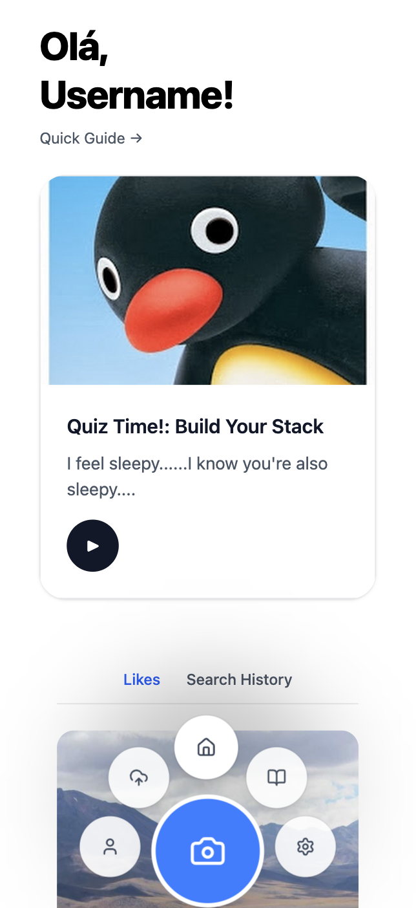

## 3. Using FANGO in the Real World
it's easy! just pull your phone and take / upload a picture

### Taking or Uploading Pictures
uploading ->
- Bottom nav, click the cloud icon the second on the rigt side
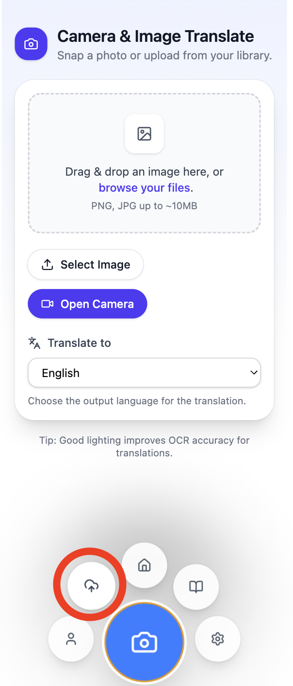

- click select image or open camera

taking a picture right away ->

- Bottom nav, find the biggest blue camera icon to take a picture
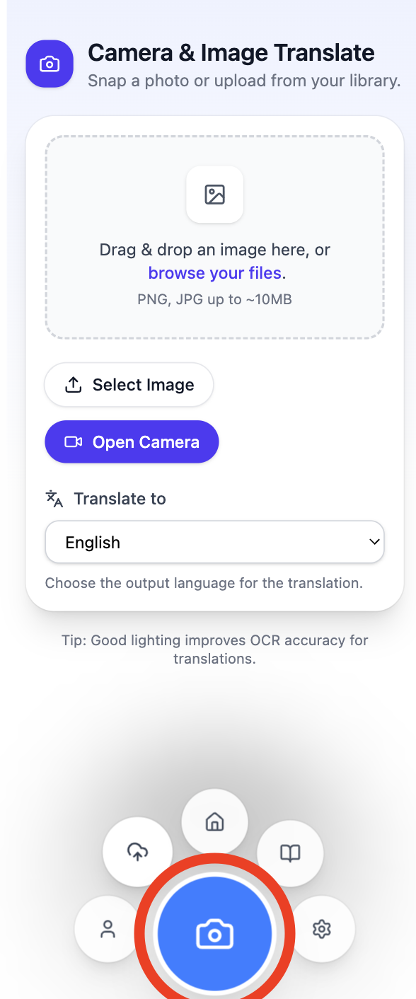

after uploading or taking picture ->
- upload a picture, then choose a language to translate
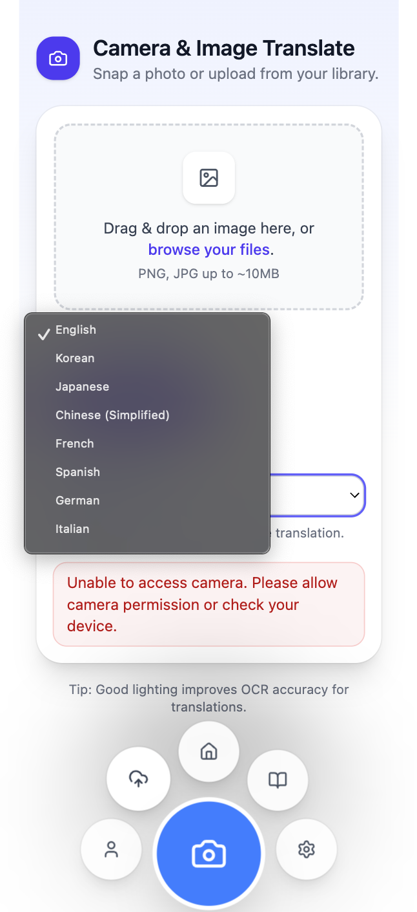

- click upload button and the iamge will be processed.

## 4. Instant Translation & Pronunciation
### Object Detection & Recognition
- from the camera image, 
### Translations
### Pronunciation
### Short Phases

## 5. Learning & Reviewing
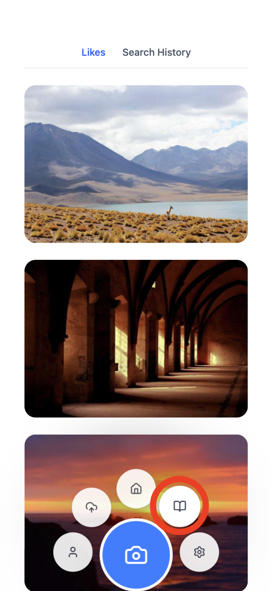
- from the bottom navigation menu, click the book icon (second right)

### Learning History
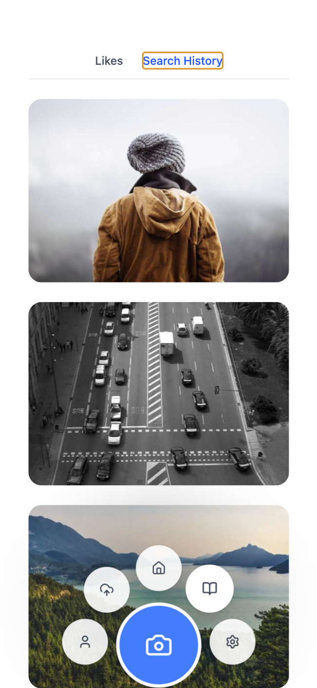

- search history displays pictures what you've searched 
- if you click the card, you can check the details 

- click details, then give a pop up card
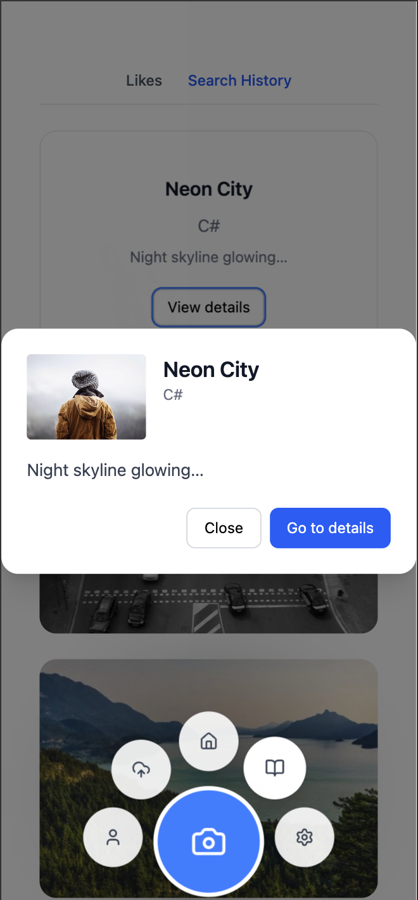

### Creating Favourites

### Examples & Content Sentences
### Quiz (Comming Soon...)
quiz tab from the landing page
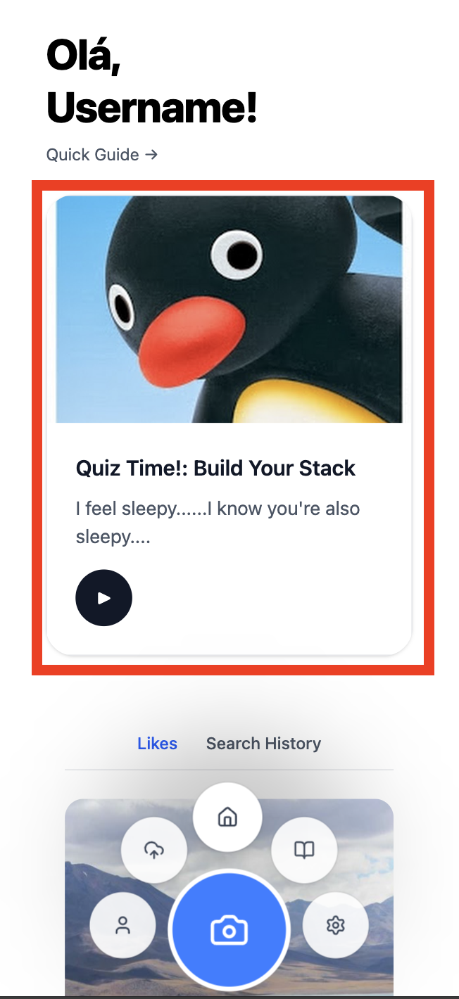

it will lead you a mock page

this quiz will help you to build learning streak 

## 6. Personalization & Settings
### Personalized Features
- From the bottom navigation menu, click the right most button

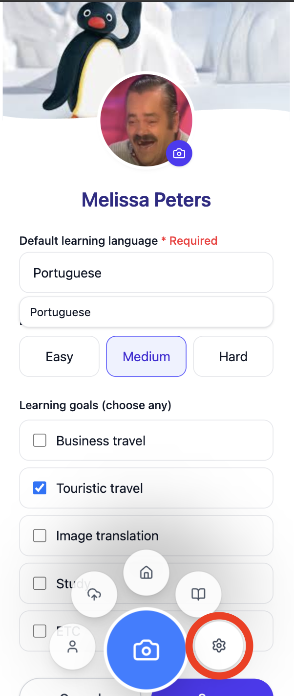

- you can customize your learning goals: learning language, learning goals...

### Notifications (Comming Soon...)

## 7. Security & Privacy
### Data Privacy
### Secuirity Measures

## 8. Troubleshooting
## 9. Frequently Asked Questions
## 10. Contact & Support
